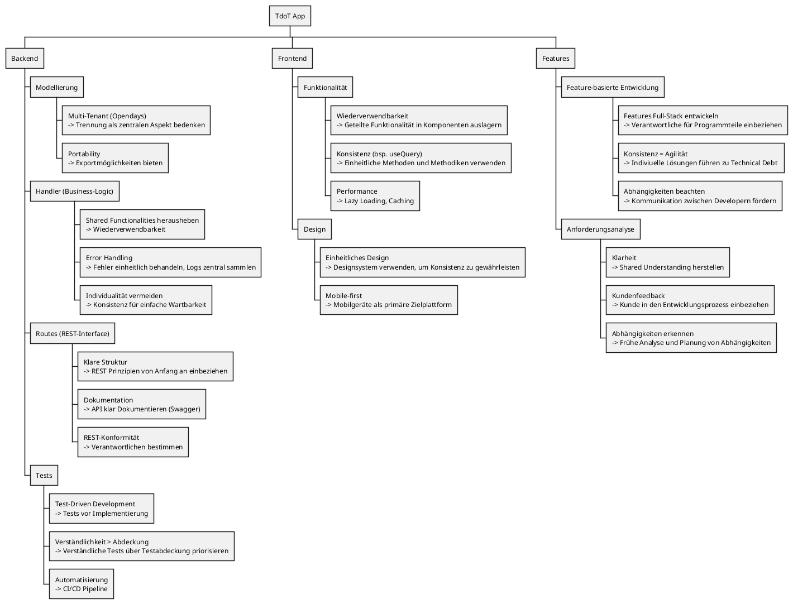

# Projektstrukturplan - TdoT App TeamA

```plantuml
@startwbs
* TdoT App
** Backend
*** Modellierung
**** Multi-Tenant (Opendays)\n-> Trennung als zentralen Aspekt bedenken
**** Portability\n-> Exportmöglichkeiten bieten
*** Handler (Business-Logic)
**** Shared Functionalities herausheben\n-> Wiederverwendbarkeit
**** Error Handling\n-> Fehler einheitlich behandeln, Logs zentral sammlen
**** Individualität vermeiden\n-> Konsistenz für einfache Wartbarkeit
*** Routes (REST-Interface)
**** Klare Struktur\n-> REST Prinzipien von Anfang an einbeziehen
**** Dokumentation\n-> API klar Dokumentieren (Swagger)
**** REST-Konformität\n-> Verantwortlichen bestimmen
*** Tests
**** Test-Driven Development\n-> Tests vor Implementierung
**** Verständlichkeit > Abdeckung\n-> Verständliche Tests über Testabdeckung priorisieren
**** Automatisierung\n-> CI/CD Pipeline
** Frontend
*** Funktionalität
**** Wiederverwendbarkeit\n-> Geteilte Funktionalität in Komponenten auslagern
**** Konsistenz (bsp. useQuery)\n-> Einheitliche Methoden und Methodiken verwenden
**** Performance\n-> Lazy Loading, Caching
*** Design
**** Einheitliches Design\n-> Designsystem verwenden, um Konsistenz zu gewährleisten
**** Mobile-first\n-> Mobilgeräte als primäre Zielplattform
** Features
*** Feature-basierte Entwicklung
**** Features Full-Stack entwickeln\n-> Verantwortliche für Programmteile einbeziehen
**** Konsistenz = Agilität\n-> Indiviuelle Lösungen führen zu Technical Debt 
**** Abhängigkeiten beachten\n-> Kommunikation zwischen Developern fördern
*** Anforderungsanalyse
**** Klarheit\n-> Shared Understanding herstellen
**** Kundenfeedback\n-> Kunde in den Entwicklungsprozess einbeziehen
**** Abhängigkeiten erkennen\n-> Frühe Analyse und Planung von Abhängigkeiten
@endwbs
```
