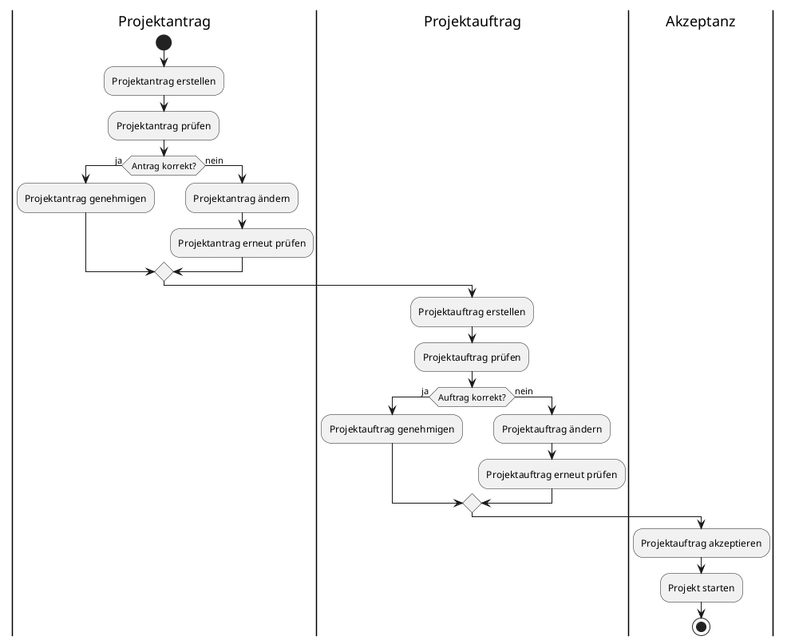

# Projektantrag & Projektauftrag

## Unterschiede Antrag vs Auftrag

|                      | Projektantrag                                                                      | Projektauftrag                                                                           |
| -------------------- | ---------------------------------------------------------------------------------- | ---------------------------------------------------------------------------------------- |
| Erstellungszeitpunkt | Vor der Genehmigung/Annahme des Projekts                                           | Vor dem Projektantrag                                                                                    |
| Zweck                | Überzeugen eines Vorgesetzten von der Sinnhaftigkeit / Rentabilität eines Projekts | "Vereinbarung" mit dem Vorgesetzen bez. der Rahmenbedingungen (Ressourcen, Rollen, etc.) |
| Initiator            | Beliebiger Antragsteller (Mitarbeiter, Kunde, ...)                                 | Projektleiter / Auftraggeber                                                             |

### Aufbau Antrag
- Projekttitel
- Antragsteller
- Problemstellung
- Ziele, Mehrwert
- Scope 
- Ungefähre Planung
- Risiken

### Aufbau Auftrag 
- Projekttitel/name (+ Nummer ggf.)
- Auftraggeber
- Weitere Rollen (Team, Projektleiter)
- Ziele, Mehrwert
- Scope
- Zeitplan
- Risiken
- Ressourcen
- Genehmigungen

## Gemeinsamkeiten
- Beschreibt einen geplanten Ablauf einese Projekts
- Ansonsten verschwindend wenig

## Beispielantrag
(Stark verkürzt zur effektiven Veranschaulichung)
### Erneuerung veralteter Firmeninfrastruktur und Einarbeitung von Standards und Protokollen
- Antragsteller: Julian Reissner

#### Problemstellung
Firmeninterne (Web)services wurden immer dezentralisiert und on-demand erstellt und gewartet.
Aufgrunddessen sind vor allem alte Services zu ressourcenintensiv zu warten.

#### Ziele und Lösungen
- Etablierung von Standards für firmeninterne Services (Programmiersprache, ...)
- Aufbesserung aller noch relevanten Services
- Entfernen von nicht mehr gebrauchten Services

#### Profit
- Weniger Aufwand für zukünftige Wartungen
- Einheitliche Prozesse für die Erstellung neuer Services in der Zukunft

#### Scope
Projekt umfasst alle bis dato relevanten Services im Betrieb

#### Planung
- Wasserfallmodell
- Zeit: 6 Monate
- Kosten: 4000€ / Monat / Teammitglied bei 6 Teammitgliedern

#### Risiken
- evtl. fehlende Rentabilität
- unerwartete Komplikationen bei der Aufbesserung von alten Services (fehlende Bibliotheken, Versionskonflikte)

## Aktivitätsdiagramm

